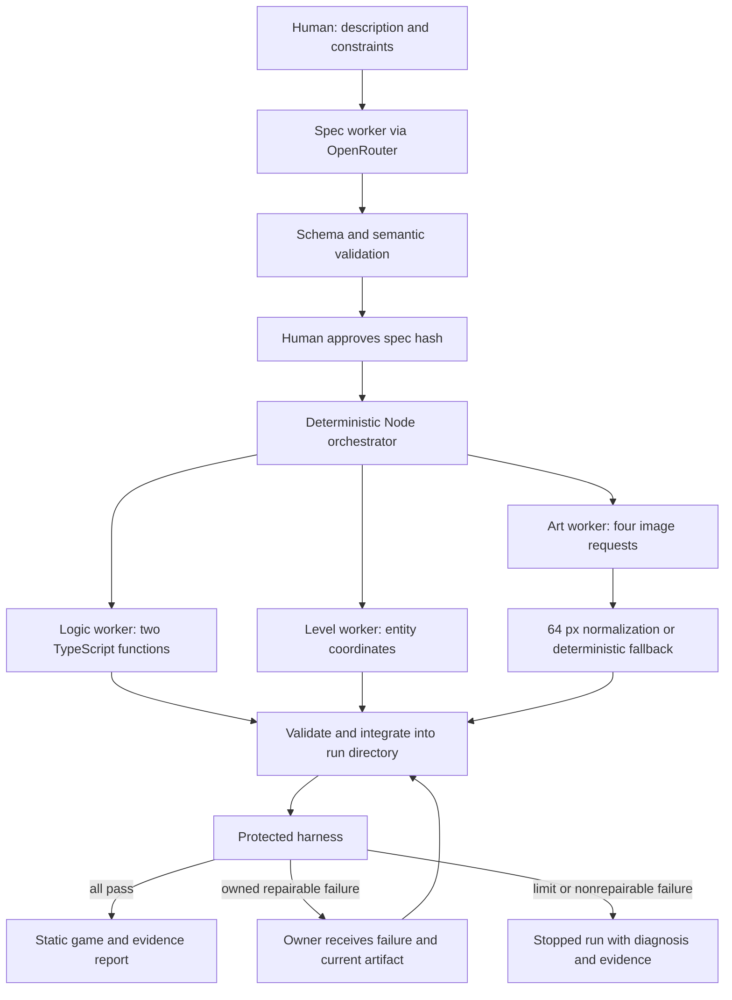

# Agentic system design

Status: implemented and live-evaluated as of 2026-09-11. The diagram describes the shipped flow; fixture and credentialed evidence for overlap and recovery are linked below.

## 1. System map



The orchestrator is ordinary application code. Do not make an LLM decide when to run tests, which files are protected, or whether an exit status counts as success. Review/repair is a fresh task invocation using the owning role's schema, not a separate always-running service.

## 2. OpenRouter adapter

User-selected backend: OpenRouter API key. Use native Node fetch; implement one adapter before any role worker.

Environment variables to document in `.env.example`:

```dotenv
OPENROUTER_API_KEY=
OPENROUTER_MODEL=
# Optional role overrides; blank means OPENROUTER_MODEL.
OPENROUTER_SPEC_MODEL=
OPENROUTER_LOGIC_MODEL=
OPENROUTER_LEVEL_MODEL=
OPENROUTER_ART_MODEL=
OPENROUTER_REPAIR_MODEL=
```

Load `.env` only in Node, through a single config module. Do not use a `VITE_` prefix for secrets. Do not make API requests during test/build/module import. Missing required configuration is a `doctor`/generation error, not a reason for offline verification to fail.

Adapter interface:

```ts
type ModelRequest = {
  requestId: string;
  role: 'spec' | 'logic' | 'level' | 'art' | 'repair';
  model: string;
  system: string;
  user: string;
  schemaName: string;
  schema: object;
  maxOutputTokens: number;
};
type ModelResult = {
  content: unknown;
  responseId: string;
  requestedModel: string;
  returnedModel: string;
  provider: string | null;
  promptTokens: number | null;
  completionTokens: number | null;
  reportedCostUsd: number | null;
  elapsedMs: number;
};
interface ModelClient {
  generate(request: ModelRequest, signal: AbortSignal): Promise<ModelResult>;
}
```

Request shape:

```ts
const body = {
  model: request.model,
  stream: false,
  messages: [
    { role: 'system', content: request.system },
    { role: 'user', content: request.user }
  ],
  max_tokens: request.maxOutputTokens,
  provider: { require_parameters: true },
  response_format: {
    type: 'json_schema',
    json_schema: {
      name: request.schemaName,
      strict: true,
      schema: request.schema
    }
  }
};
```

Send POST to `https://openrouter.ai/api/v1/chat/completions` with JSON content type and bearer authentication. This is the documented direct API route ([OpenRouter quickstart](https://openrouter.ai/docs/quickstart)). Structured output support varies by endpoint: require parameter support, use a compatible configured model, and still validate locally. Do not fall back silently to free-form parsing ([structured output documentation](https://openrouter.ai/docs/guides/features/structured-outputs)).

Parse both HTTP status and response body errors. Reject absent choices, empty content, truncated output, refusal/error completion, malformed JSON, and schema violations. Preserve a sanitized failure summary. Do not extract JSON by arbitrary regex or accept Markdown-fenced code as a valid response.

Transport retry policy: up to two retries for network errors, timeouts, 408, 429, and 5xx. Delay 1 second, then 3 seconds, unless a valid `Retry-After` asks for longer. Parse both delta seconds and HTTP-date; if the delay exceeds remaining run time, stop. Never retry 400/401/402/403 unchanged. Response-body errors can occur after a successful HTTP status, so inspect them too ([OpenRouter error handling](https://openrouter.ai/docs/api_reference/errors-and-debugging)). Every dispatched HTTP request counts toward the global request limit.

For malformed/schema-invalid model content, the worker layer may make one correction request containing the previous output and exact validation errors. This is separate from transport retries. Limit previous content to the documented artifact size; oversized output is rejected with its hash and size, not inserted wholesale into the next context.

## 3. Limits and accounting

Defaults, serialized into `config.json` when the run is created:

| Limit | Value |
| --- | --- |
| Parallel worker requests | 3 |
| Total dispatched completion requests per run | 16, including spec, corrections, repairs, and transport retries |
| Per-request timeout | 90 seconds |
| Active execution budget | 15 minutes total, excluding the human approval interval |
| Post-integration repair iterations | 3 total across all owners |
| Initial schema/semantic correction | 1 per worker output |
| Repair-output correction | No extra nested correction; a bad repair consumes that repair iteration |
| Context size | 24,000 UTF-8 bytes for system and user messages combined; schema separately capped at 24,000 bytes |
| Max output tokens | spec 2,500; level 3,000; art 3,000; logic and repair 4,096 |

The 15-minute budget spans spec and generation active phases and survives separate CLI invocations. Persist elapsed active time and request counts atomically. Reserve an available request slot before launching a concurrent call to avoid exceeding the cap through races. Aborting a local request does not guarantee that provider work or billing stopped.

Report tokens, duration, request count, returned model/provider when present, and reported cost when present. Unknown cost is `null`, never zero. Token/request limits are not a guaranteed dollar cap. For a firm account-side spending boundary, use an OpenRouter key credit limit; OpenRouter documents key limits and remaining credits separately ([credit limit documentation](https://openrouter.ai/docs/api_reference/limits)).

Do not implement automatic upgrades to a more expensive model. Choose and record model IDs before a run. Begin with a smaller structured-output-capable model and evaluate the fixed tasks. Use role overrides only when measured failures justify them. A stronger model is optional, not required to satisfy the design.

## 4. Context packets

Each call gets the role prompt, output schema, a compact task packet, and no previous conversation by default.

| Role | Include | Exclude |
| --- | --- | --- |
| Spec | Original description, seed, supported capabilities, defaults and bounds | Source repository, worker logs, credentials |
| Logic | Approved mechanics, exact type declarations, two behavior truth tables, example module skeleton | Art grids, full level coordinates, original conversation |
| Level | Counts, seed, arena, distances, quadrant constraint, one valid coordinate example | Game source, API settings, art |
| Art | Identity, entity names, palette, signature mechanic, 64 by 64 sprite constraints, and one entity per request | Logic source, tests, level coordinates |
| Repair | Current owner artifact, relevant contract, approved spec subset, first 3 failures for that owner, relevant text logs, prior rejected-repair errors, and a complete valid low-complexity example for logic | Other workers' histories, unrelated source, credentials |

Preserve the context packet and its SHA-256 alongside the response. Store full sanitized logs locally, but send at most 8,000 bytes of failure excerpts with filenames and line numbers. Keep the contract and actual failure ahead of optional examples when reducing context. If required context still exceeds the limit, stop with `CONTEXT_LIMIT`; never silently remove the contract.

Repair models need text assertions and current code. Screenshots are judge/human evidence in the MVP; do not require vision support. Save model-visible prompts and outputs, not private chain-of-thought.

## 5. Worker execution and integration

1. Acquire the single active-generation lock using exclusive file creation. A second active run exits clearly. A stale lock after a crash is an explicit recovery condition, not an invitation to delete another process's files.
2. Revalidate approved spec and its hash. Snapshot protected baseline file hashes.
3. Derive manifest from trusted constants.
4. Submit logic, level, and art to a bounded worker pool controlled by `parallelWorkers`. With the default of three, all begin together; lower limits queue work without exceeding configured concurrency.
5. Emit start and terminal events and save each worker response as that worker actually starts or settles. Only the orchestrator selects final accepted outputs.
6. Validate role schemas and semantic constraints. Initial invalid output gets one role correction. Art may fall back as described in CONTRACTS; invalid logic or level stops the run after its correction limit.
7. Construct run-local integration files from accepted artifacts; use fixed filenames, never paths from model text.
8. Build and verify through the fixed harness.
9. On success, produce the report and expose the current production build. On failure, enter repair routing.
10. Always release owned process resources and lock in `finally`; always write a terminal report, including on interruption where possible.

The Vite config maps `@generated/rules`, `@generated/spec`, and `@generated/level` to selected integration files. `publicDir` points at the selected integration public directory. `base` is `./` so exported game assets use relative URLs. Use `tests/fixtures/reference` when no run is selected. Never copy current output over reference fixtures.

## 6. Repair routing

| Observed failure | Owner/action |
| --- | --- |
| Invalid level counts, bounds, spacing | Level correction/repair |
| Pixel grid or PNG failure | Art correction, then visible fallback where permitted |
| TypeScript error originating in generated rules | Logic |
| Chase/patrol behavior or objective assertions | Logic |
| Missing approved artifact at integration | Harness/integration stop |
| Input, health cooldown, collection bookkeeping, restart bug | Runtime stop; toolkit implementation work is required |
| Test process cannot launch, dependency/browser missing, server cannot start | Infrastructure stop with actionable diagnostic |
| Schema/test/config/protected-file mutation | Stop immediately; do not ask the worker to repair the evaluator |
| Ambiguous or conflicting ownership | Stop with evidence; do not guess which trusted file to change |

The first playable baseline must establish trusted runtime correctness before live generation. The live repair loop intentionally handles generated artifacts only; it cannot autonomously rewrite the entire toolkit.

For multiple repairable failures, repair one owner at a time in fixed order: logic, level, art. Send up to three failures for that owner. If any blocking runtime/harness/infrastructure failure exists, stop instead of spending requests on speculative repairs.

Loop semantics: attempt 0 is the initial full verification. After a failed attempt, if fewer than 3 repair iterations have been dispatched and all other limits permit, invoke the owner, validate its replacement, preserve before/after/diff, integrate, and run the full harness as attempt N+1. A rejected replacement consumes an iteration and records a failed verification summary; do not integrate it. No nested unbounded repair loop.

All-pass is computed from the required check list and process results, never from model output. Reaching any cap produces `stopped`, an explicit reason code, and the latest evidence.

## 7. Controls and trust boundary

OpenRouter workers receive text and return text. They have no filesystem tools, shell tools, test-editing tool, or network tool. The trusted writer accepts only each role's fixed artifact shape and fixed destination. Thus a model response cannot directly overwrite tests or the repository.

Before accepting logic source, parse its TypeScript AST: require the exact type import and two exported function declarations; allow only a small numeric/boolean expression and statement subset needed by these functions. Allow `Math.sqrt`, `Math.hypot`, `Math.abs`, and `Math.sign`; reject other global access, dynamic imports, computed property access, loops, `new`, async, eval, and top-level executable statements. Enumerate the accepted AST node kinds in code, default-deny unknown kinds, and test representative valid and invalid modules.

This source filter reduces accidental scope violations. It is not a claim of a hardened sandbox for hostile code. Build transforms must not execute generated module code in Node. Generated behavior tests execute in a fresh Chromium context, with service workers blocked and requests denied except the selected local static game server. Do not run a credential-bearing control API on that origin. Trusted tests live outside generated output, and child processes receive a sanitized environment without the API key.

Protected baseline includes `tests/**`, `src/contracts/**`, `src/runtime/**`, trusted game/debug source, toolkit code, prompts, package and lock files, and test/build configs. Compare hashes before and after verification; also detect added/deleted protected files. The baseline is created from the clean trusted tree for the run and is never supplied as a mutable worker artifact.

Human implementation agents may change trusted files while implementing an assigned task. The runtime-generated workers may not. Do not confuse these two scopes.

## 8. Evidence and status

Run states: `draft`, `awaiting-approval`, `generating`, `integrating`, `verifying`, `repairing`, `verified`, `stopped`. Legal transitions must be encoded and tested. Approval is legal only from `awaiting-approval`; generation requires matching approval and cannot run twice concurrently. MVP interrupted runs stop; automatic crash-resume is out of scope. A retry after a terminal failure starts a new run rather than rewriting evidence.

The HTML report is generated from validated JSON/events. Escape every string before inserting it into HTML. Show prompt, approved spec, status, model IDs, actual overlapping worker intervals, verification results, repair diffs, evidence links, cost availability, and art fallback status. Failed or incomplete runs must not show a verified badge.

For submission, curate one real run under `evidence/`, keep relative links intact, redact secrets, and label evidence provenance (`live`, `fixture`, or `injected-fault`). Do not invent worker timestamps, fixes, or transcripts.

## 9. Implemented evidence map

The trusted orchestrator dispatches logic, level, and art through a bounded worker pool. `tests/integration/orchestrator.test.ts` uses a barrier-backed fake client: with the default concurrency of three, all roles must reach the barrier before any response is released. Completion events are written when each promise settles, so the report timeline reflects the actual critical path. The same test asserts that integration files exist before verification begins.

```mermaid
gantt
  title Fixture-verified parallel orchestration
  dateFormat X
  axisFormat %L
  section Workers
  Logic request :0, 4
  Level request :0, 4
  Art request :0, 4
  section Trusted pipeline
  Integrate :4, 1
  Verify :5, 3
```



The live Storm run records the same overlap with provider latency rather than fixture delays:

```mermaid
gantt
  title Storm Courier worker time after dispatch (seconds)
  dateFormat X
  axisFormat %S
  section Workers
  Logic :0, 3
  Level including correction :0, 15
  Art, four image requests :0, 28
  section Trusted pipeline
  Integrate and inject labeled fault :28, 1
  Verify attempt 0 :29, 19
  Repair model :48, 11
  Verify attempt 1 :59, 22
```



The injected-fault repair test supplies a source-valid but behaviorally incorrect logic module. Attempt 0 reports a logic-owned policy failure. The repair worker returns a complete replacement; the orchestrator saves before, after, and diff artifacts, reintegrates, and attempt 1 passes. No human callback exists in this path. A second test rejects three replacements and asserts exactly three repair calls. Verification clears only its own logs, screenshots, and result file when rerun, preserving the repair artifacts already written into that attempt.

Reference verification evidence is curated under `evidence/reference/`. Credentialed timings, returned model/provider IDs, token use, reported cost, worker overlap, and screenshots are curated under `evidence/live-greenhouse/`, `evidence/live-moon/`, `evidence/live-storm/`, and `evidence/LIVE-RUNS.md`. Storm contains a live OpenRouter repair after a clearly labeled injected fault; `evidence/AUTONOMOUS-REPAIR.md` maps every step to its artifact. The observed earlier harness failure and its preserved pre-fix evidence remain under `evidence/live-recovery/`.
